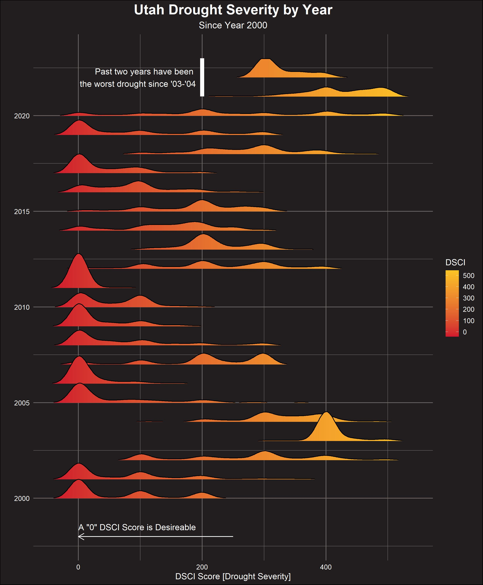

# US Drought | Week 24 - 2022, TidyTuesday
My contribution to week 24 TidyTuesday: yearly drought score distributions since 2000 in the state of Utah.

## Description

In my home state of Utah, we're no strangers to droughts. The past two years in particular have been especially painful.

This week I was interested in how the past two years have compared to other stretches since 2000. The visualization showed that 2003-04 was another brutal
stretch for Utahns. I also find it interesting that many of the serious droughts have *more* normal or bimodal distributions compared to a standard year that
sees more of a chi-squared looking distribution.

## Core Packages I Use
{ggplot2} for core data visualization

{ggridges} for for the grouped density plots

Additional {tidyverse} packages for dat manipulation

## TidyTuesday References
[Week 24 TidyTuesday Repo](https://github.com/rfordatascience/tidytuesday/tree/master/data/2022/2022-06-14)
