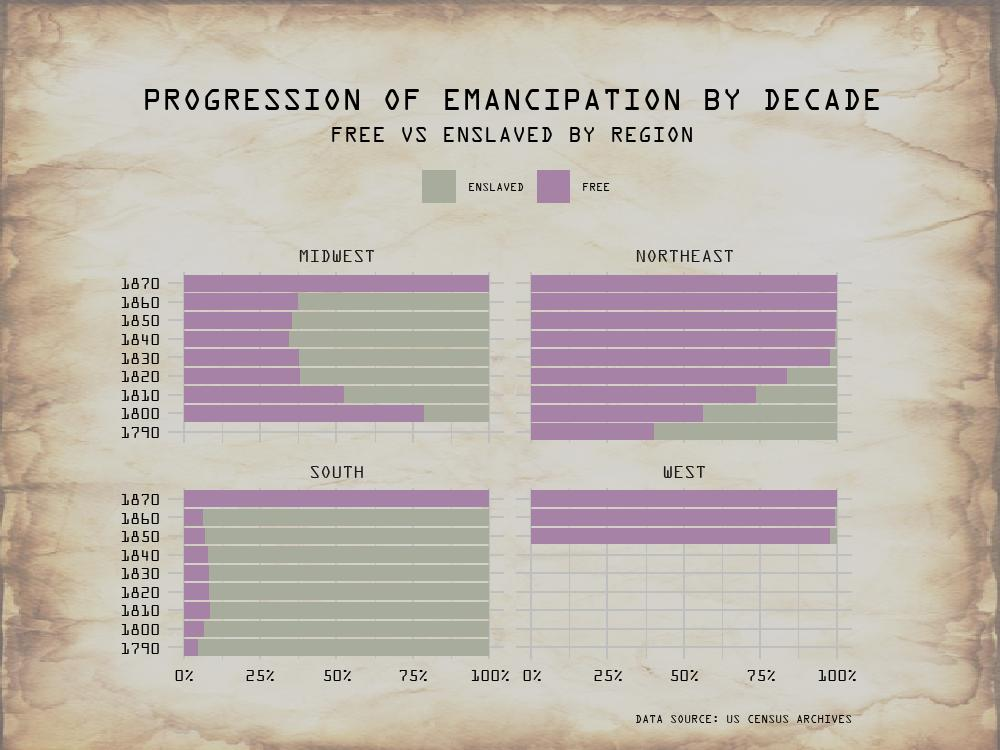

# Juneteenth | Week 25 - 2022, TidyTuesday
My contribution to week 25 TidyTuesday: the progression of emmancipation during the celebration of Juneteenth.

## Description

Juneteenth, or Emmancipation Day, celebrates the official ban of slavery in the United States.

This week I was interested in the census data, specifically how regions embraced emancipation throughout the decades. The visualization displays four geographic
regions of the United States and 100% horizontal bar charts depicting the share of Free to Enslaved individuals. I worked to recreate a basic version of 
[W.E.B DuBois' 100% horizontal bar chart](https://medium.com/nightingale/style-and-rich-detail-on-viewing-an-original-w-e-b-du-bois-data-visualization-part-4-40cc7bd18cfb). 
I found it interesting that how the visual confirms what we know historically but illustrates it in a more drastic manner (the West was a safehaven, the North
progressed very quickly, while the South and Midwest refused to implement change).

I was very excited for this #TidyTuesday challenge. I practiced several data viz principles, namely facet wrapping, background images, custom fonts, and 100% bar charts.
Refer to the .R file for a walkthrough of creating the visualization.

## Core Packages I Use
{ggplot2} for core data visualization

{ggimage} for background images

{showtext} for custom font

Additional {tidyverse} packages for data manipulation

## TidyTuesday References
[Week 25 TidyTuesday Repo](https://github.com/rfordatascience/tidytuesday/tree/master/data/2022/2022-06-21)
