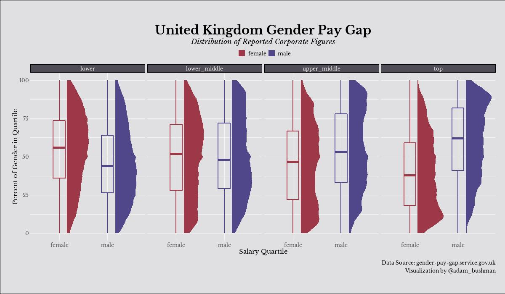

# UK Gender Pay Gap | Week 26 - 2022, TidyTuesday
My contribution to week 26 TidyTuesday: the gender pay gap present in United Kingdom Corporations.

## Description

Compensation equality is an important intiative and despite the leaps society has made over the decades to align pay gaps between demographics, there's more work to do.
This week I was interested in the salary quartiles (lower wages, lower-middle, upper-middle, top) and how often each gender was found therein among UK corporations.

We can see that women are common in the "lower" wages quartile (far-left plot) while men are more commonly represented in the "upper" wages quartile in comparison to
women. Translation: there remain gender compensation inequalities within organizations. Similar phenomena can be seen in the lower-middle and upper-middle quartiles, 
though the effects are more subtle.

I was able to practice several data viz principles through this project: facet wrapping, custom fonts, and margins.
Refer to the .R file for a walkthrough of creating the visualization.

## Core Packages I Use
{ggplot2} for core data visualization

{showtext} for custom font

Additional {tidyverse} packages for data manipulation

## TidyTuesday References
[Week 26 TidyTuesday Repo](https://github.com/rfordatascience/tidytuesday/tree/master/data/2022/2022-06-28)

## Other Resources Used
[Raincloud Plots](https://www.cedricscherer.com/2021/06/06/visualizing-distributions-with-raincloud-plots-and-how-to-create-them-with-ggplot2/)
