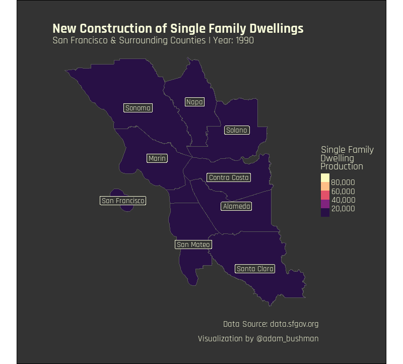

# San Francisco Rents | Week 27 - 2022, TidyTuesday
My contribution to week 27 TidyTuesday: new construction of single family dwellings in San Francisco and surrounding counties between 1990 and 2018.

## Description

This week's #TidyTuesday featured datasets on rent, permits, and new construction. I was interested in the new construction, primarily that of single family homes.
It's no secret that densely populated areas around the world are transitioning from single family homes to multi-family dwellings. My hypothesis is that counties 
closest to San Francisco will slow in their development of single family dwellings over the past decades.

I took a stab at creating an animated visual to try and capture this phenomena over time and test this hypothesis. We can see in the final result that event took
place in some instances but not others. Contra Costa, Alameda, and Santa Clara sustained large development of single family homes, while the others, particularly
Solano, Sonoma, and San Francisco counties slowed their development. In fact, San Mateo, Napa, and Marin counties all but maintained their cumulative production.

I was able to practice several data viz principles through this project: animation, custom fonts, margins, special features, and labeling.
Refer to the .R file for a walkthrough of creating the visualization.

## Core Packages I Use
{ggplot2} for core data visualization

{sf} and {tigris} for special feature objects and plotting

{gganimate} for the animation

{showtext} for custom font

Additional {tidyverse} packages for data manipulation

## TidyTuesday References
[Week 27 TidyTuesday Repo](https://github.com/rfordatascience/tidytuesday/tree/master/data/2022/2022-07-05)
