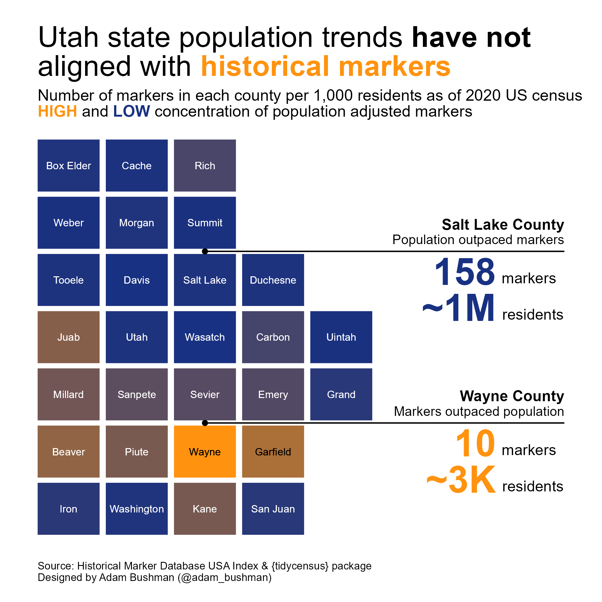

# Utah historical markers \| Week 27 - 2023, TidyTuesday

My contribution to week 27 TidyTuesday: a visual look into the misalignment of population trends and historical marker distribution throughout Utah counties.

## Description

This week's #TidyTuesday featured a data set on historical markers throughout the United States. Specifically, where they are located, what they are called, and in some cases when they were erected.

I became interested in Utah's historical landmark distribution throughout the state. It became clear most were concentrated in densely populated counties. However, I began to wonder if, after adjusting for population, the same trend would apply. The exploratory analysis and visualization explain this question.

I was able to practice several data viz principles through this project: tiled maps, plotting polygons, advanced annotations, and styled text. Refer to the .qmd file for a walk through of creating the visualization.

## Core Packages I Use

{ggplot2} for core data visualization

{tidycensus} for collecting county level population data

{camcorder} to produce the final PNG

{adamb} to calculate the text color for ideal contrast to a background color

Additional {tidyverse} packages for data manipulation

## TidyTuesday References

[Week 27, 2023 TidyTuesday Repo](https://github.com/rfordatascience/tidytuesday/blob/master/data/2023/2023-07-04/readme.md)
