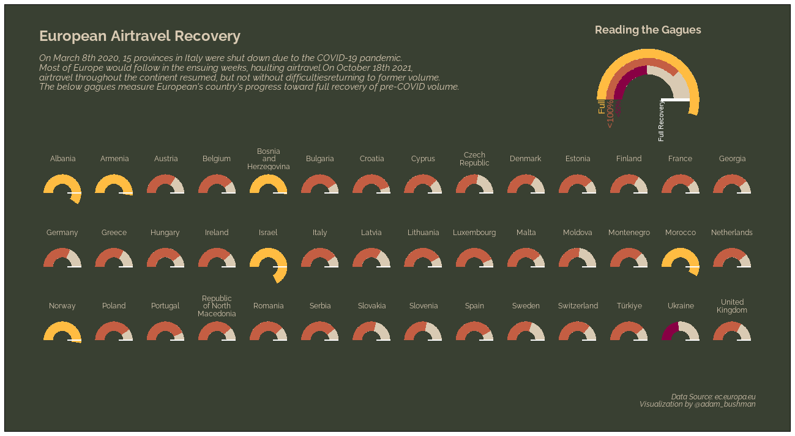

# European Airtravel Recovery | Week 28 - 2022, TidyTuesday
My contribution to week 28 TidyTuesday: airtravel recovery from COVID-19 pandemic across European countries.

## Description

This week's #TidyTuesday featured a dataset on air travel in European countries, specifically in the years leading up to, during, and in the wake of the COVID-19
pandemic. On March 8th 2020, 15 provinces across Italy shut down and most of Europe followed in the ensuing weeks. It wasn't until October 18th 2021 that airtravel
approximated normality again. But a return to the skies faced challenges with reduced volume.

I wanted to visualize this progress to recovering airtravel volume from before the pandemic. I compared the monthly average of total flight volume post- to pre-pandemic.
The results depict a generally slow return to "normal" flight volume, with a few exceptions on the high end (like Albania, Israel, and Morocco) who've recovered
nicely while the context of war for the low end (like Ukraine) is a disheartening realization.

I was able to practice several data viz principles through this project: using gauge plots, wrapping facet labels, custom legend, and insets.
Refer to the .R file for a walkthrough of creating the visualization.

## Core Packages I Use
{ggplot2} for core data visualization

{patchwork} for insetting the custom legend

{showtext} for custom font

Additional {tidyverse} packages for data manipulation

## TidyTuesday References
[Week 28 TidyTuesday Repo](https://github.com/rfordatascience/tidytuesday/tree/master/data/2022/2022-07-12)
