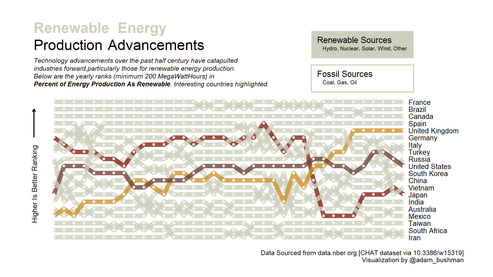

# Renewable Energy Production | Week 29 - 2022, TidyTuesday
My contribution to week 29 TidyTuesday: rankings of renewable energy production as percent of total.

## Description

This week's #TidyTuesday featured a dataset on technology advancements across industries. I decided to check in on advancements in the energy field. 
I found that the data was categorized by energy type (i.e. coal, solar, etc.) which allowed me to define a new variable: renewable vs fossil. 
I wanted to look at countries with enough total product and see their rank changes over time.

I found several insights, namely that European countries (such as France) have generally performed well in prioritizing renewable energy production since the 
beginning of the dataset (mid 1980's). I was surprised to see countries like Japan reduce their share of energy production as renewable over the past decade.
My home country of the USA displays visually what may know intuitively: there's no prioritization shift on a macro scale towards renewable sources.

I was able to practice several data viz principles through this project: building bump charts, custom legend, insets, markup styling, etc.
Refer to the .R file for a walkthrough of creating the visualization. I also created a neat .gif of my step-by-step in creating the data viz (below):

## Core Packages I Use
{ggplot2} for core data visualization

{patchwork} for insetting the custom legend

{ggtext} for styling the text

{NatParksPalettes} for the palette

{camcorder} to produce the .gif

{countrycode} to convert ISO codes to country names

Additional {tidyverse} packages for data manipulation

## TidyTuesday References
[Week 29 TidyTuesday Repo](https://github.com/rfordatascience/tidytuesday/tree/master/data/2022/2022-07-19)
