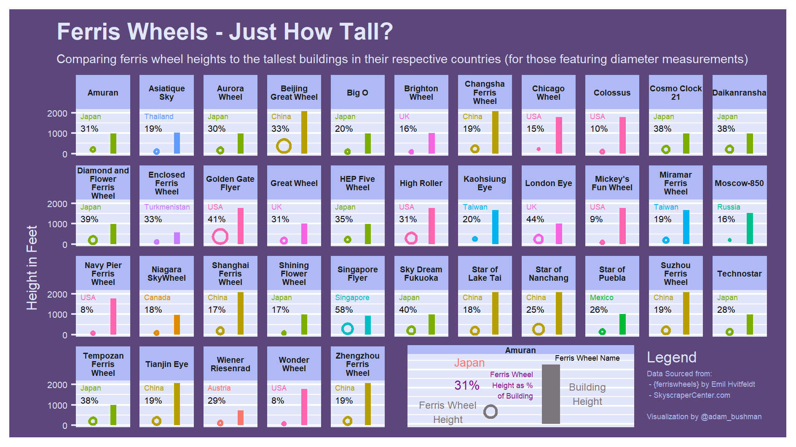

# Ferris Wheel Heights vs Tallest Buildings by Country | Week 32 - 2022, TidyTuesday
My contribution to week 32 TidyTuesday: comparing ferris wheel heights to the tallest buildings in their respective countries.

## Description

This week's #TidyTuesday featured a dataset from Emil Hvitfeldt and his {ferriswheels} package which contains a vast number of features related to ferris wheels
around the world. I was interested in just how tall relevant ferris wheels truly where and thought to compare them to the tallest building in each country.

The visualization reveals that most countries with sizeable ferris wheels also have sizeable buildings. However, there are some exceptions. The "Singapore Flyer" 
comprises 58% of the country's tallest building while the "Niagra SkyWheel" in Canada is just 18% of the tallest building therein.

I was able to practice several data viz principles through this project: plotting circles and facets.
Refer to the .R file for a walkthrough of creating the visualization.

## Core Packages I Use
{ggplot2} for core data visualization

{ggforce} for plotting the circle geom

{patchwork} for assembling the plot and legend

{camcorder} to produce the final PNG

Additional {tidyverse} packages for data manipulation

## TidyTuesday References
[Week 32 TidyTuesday Repo](https://github.com/rfordatascience/tidytuesday/tree/master/data/2022/2022-08-09)
